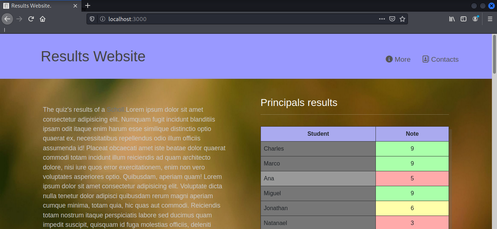

# Results Website.

__This is a results website, made with python-flask, bootstrap as framework for css, and sqlite3 as database, for save the results.__

## Installation.

```bash
git clone https://github.com/EduardYan/results-website.git

cd results-website

```

## Dependencies.

__Install from requirements file, executing:__

```bash
pip3 install -r requirements.txt
```

## Run.

```bash
python3 index.py
```

Now you can visit this direction: <a href="http://localhost:3000" target="_blank">http://localhost:3000</a>

## Screenhost.
